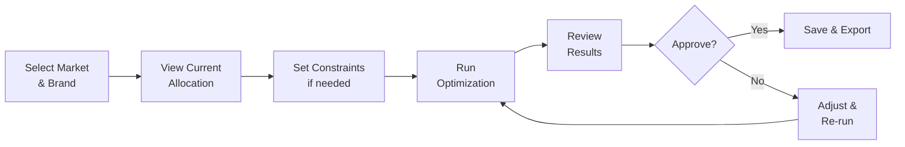
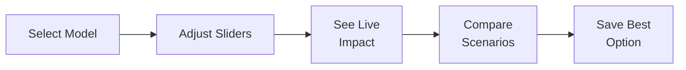

# BAWT - Product Designer Guide

## Document Information

| Field | Value |
|-------|-------|
| Project | BAWT (Budget Allocation Workflow Tool) |
| Audience | Product Designers, UX Designers |
| Date | December 2024 |

---

## 1. Product Overview

### What is BAWT?

BAWT is a **media planning optimization tool** that helps marketing teams allocate advertising budgets more effectively. It uses data science (Marketing Mix Modeling) to recommend how to split budget across channels like TV, Digital, Social, etc.

### Target Users

| Persona | Role | Goals |
|---------|------|-------|
| **Media Planner** | Plans media spend across channels | Find optimal budget mix |
| **Brand Manager** | Owns brand marketing budget | Maximize brand lift |
| **Analytics Lead** | Manages MMM models | Keep curves updated |
| **Finance** | Approves budgets | Justify spend decisions |

---

## 2. User Flows

### 2.1 Optimization Flow (Primary)



### 2.2 Simulation Flow



---

## 3. Information Architecture

### 3.1 Navigation Structure

```
Dashboard
├── KPI Overview
├── Recent Results
└── Quick Actions

Simulate
├── Step 1: Setup (Select Model, Curves)
├── Step 2: Scenario (Adjust Budgets)  
├── Step 3: Configure (Set Constraints)
└── Step 4: Results (View Outcomes)

Optimize
├── Step 1: Setup (Select Market, Brand)
├── Step 2: Current State (View Allocations)
├── Step 3: Constraints (Set Limits)
└── Step 4: Results (Optimized Plan)

Compare
├── Scenario Selector
├── Side-by-Side View
└── Delta Analysis

View (Curves)
├── Response Curve Charts
├── Channel Filters
└── Export Options

Results Manager
├── Search & Filter
├── Actions (View, Edit, Share, Delete)
└── Bulk Export

Data Manager
├── Response Curves Table
├── CPM Data Table
├── Import/Export
└── Templates
```

---

## 4. Key Screens

### 4.1 Dashboard

**Purpose:** Landing page with KPIs and navigation

**Key Elements:**
- 4x KPI cards (Total Budget, Allocated %, Remaining, Active Scenarios)
- Recent results table
- Quick action buttons
- Sidebar navigation

### 4.2 Optimize - Step 1 (Setup)

**Purpose:** Select data scope for optimization

**Key Elements:**
- **Hierarchy Selector:** Cascading dropdowns
  - Market → Brand → Sub-brand → Channel
  - Week selector for CPM data
- **Data Summary:** Show # of curves, CPM coverage
- **Validation:** Check data completeness

### 4.3 Optimize - Step 4 (Results)

**Purpose:** Show optimization outcomes

**Key Elements:**
- **KPI Cards:** Total Budget, Response Lift %, Iterations, Converged
- **Allocation Table:**
  - Channel name
  - Current vs Optimized spend
  - Change % (color-coded: green up, red down)
  - Marginal ROI
  - Incremental Volume
  - Brand Lift %
- **Actions:** Save, Export CSV, Export Excel

---

## 5. Design System

### 5.1 Color Palette

| Token | Value | Usage |
|-------|-------|-------|
| `--color-primary` | `#4f8cff` | Primary actions, links |
| `--color-success` | `#00d4aa` | Positive changes, success |
| `--color-danger` | `#ff4d6d` | Negative changes, errors |
| `--color-warning` | `#ffbe0b` | Warnings, guardrails |
| `--color-bg-primary` | `#1a1d24` | Main background |
| `--color-bg-secondary` | `#22262e` | Card backgrounds |
| `--color-text-primary` | `#ffffff` | Primary text |
| `--color-text-muted` | `#8a8f98` | Secondary text |

### 5.2 Typography

| Element | Font | Size | Weight |
|---------|------|------|--------|
| H1 | Inter | 24px | 700 |
| H2 | Inter | 20px | 600 |
| H3 | Inter | 16px | 600 |
| Body | Inter | 14px | 400 |
| Small | Inter | 12px | 400 |
| KPI Value | Inter | 28px | 700 |

### 5.3 Spacing Scale

| Token | Value |
|-------|-------|
| `--space-1` | 4px |
| `--space-2` | 8px |
| `--space-3` | 12px |
| `--space-4` | 16px |
| `--space-5` | 24px |
| `--space-6` | 32px |
| `--space-8` | 48px |

### 5.4 Component Tokens

| Component | Border Radius |
|-----------|---------------|
| Button | 6px |
| Card | 12px |
| Input | 6px |
| Modal | 16px |
| Badge | 12px |

---

## 6. Interaction Patterns

### 6.1 Slider Interactions

- **Drag:** Smooth value change
- **Live Update:** Show value while dragging
- **Guardrail Warning:** Orange glow when outside recommended range
- **Linked Sliders:** Option to link channel pairs

### 6.2 Table Interactions

- **Row Hover:** Highlight background
- **Row Select:** Single click to select, show actions
- **Sort:** Click header to sort
- **Filter:** Dropdown filters above table
- **Actions:** Icon buttons with tooltips

### 6.3 Modal Patterns

| Type | Use Case |
|------|----------|
| **Confirm** | Delete actions, irreversible changes |
| **Prompt** | Rename, single-field input |
| **Form** | Create/Edit with multiple fields |
| **Share** | Copy link, email input |
| **Import** | File upload with drag-drop |

---

## 7. Responsive Considerations

| Breakpoint | Width | Adjustments |
|------------|-------|-------------|
| Desktop | ≥1200px | Full layout |
| Tablet | 768-1199px | Collapsible sidebar |
| Mobile | <768px | Stacked layout, bottom nav |

---

## 8. Accessibility

| Requirement | Implementation |
|-------------|----------------|
| Color Contrast | WCAG AA (4.5:1 for text) |
| Focus States | Visible focus ring on all interactive |
| Keyboard Nav | Tab order, Enter/Space activation |
| Screen Reader | ARIA labels on icons, buttons |
| Error States | Clear error messages, red color + icon |

---

## 9. Animations

| Interaction | Duration | Easing |
|-------------|----------|--------|
| Button hover | 150ms | ease |
| Sidebar collapse | 300ms | ease-in-out |
| Modal open | 200ms | ease-out |
| Toast notification | 300ms | ease |
| Chart update | 400ms | ease-in-out |

---

## 10. Assets Needed

### Icons (from existing icon set)
- Dashboard, Simulate, Optimize, Compare, View
- Search, Filter, Sort
- Export, Import, Download, Upload
- Edit, Delete, Duplicate, Share
- Check, X, Warning, Info
- Arrow up/down, Chevron left/right
- Chart, Table, Grid

### Charts
- Line chart (response curves)
- Bar chart (budget comparison)
- Horizontal bar (channel allocation)
- Waterfall chart (change visualization)

---

## 11. Design Files Location

| Asset | Location |
|-------|----------|
| Figma Designs | [Link to Figma] |
| Icon Set | `/assets/icons/` |
| Style Guide | `docs/style-guide.md` |
| Prototype | [Link to Prototype] |
