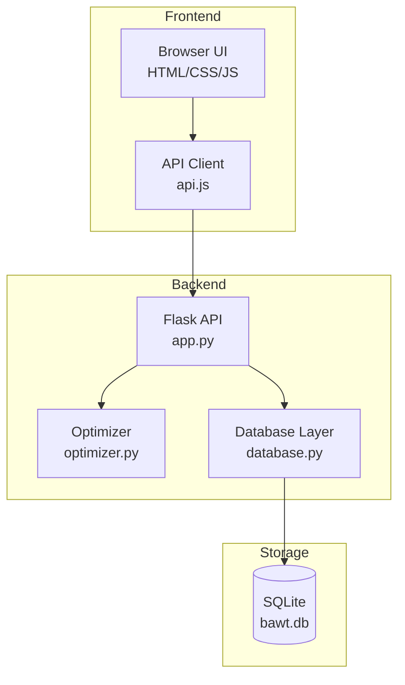
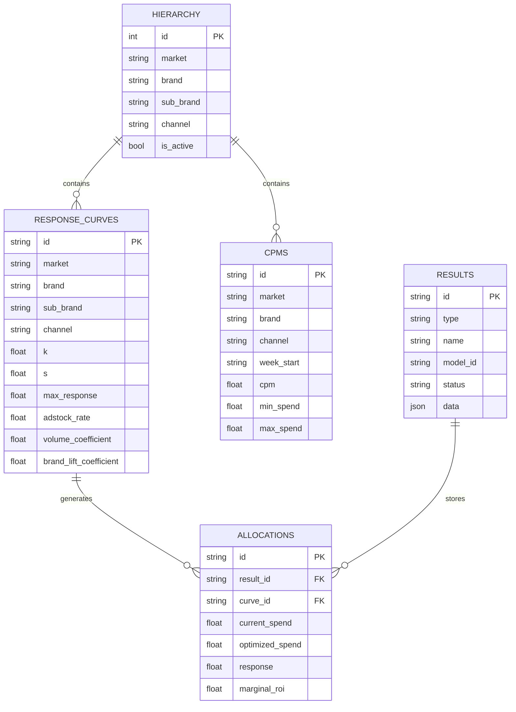
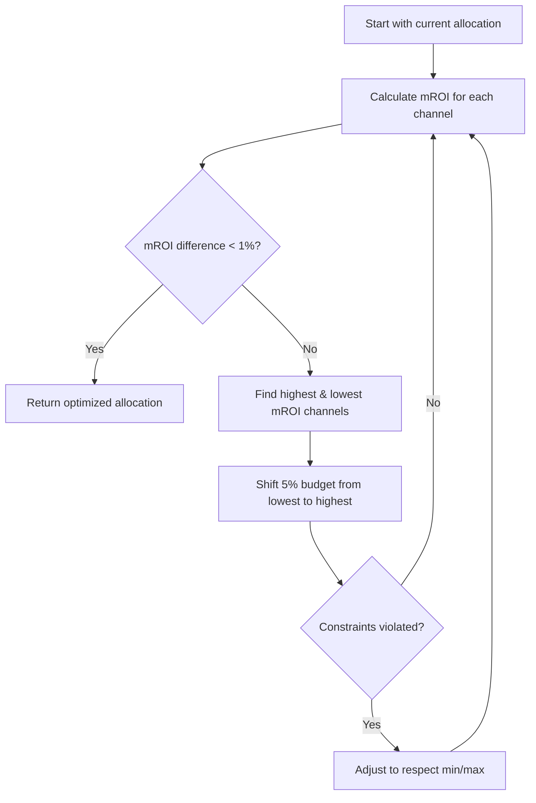

# BAWT - Technical Design Document

## Document Information

| Field | Value |
|-------|-------|
| Project | BAWT (Budget Allocation Workflow Tool) |
| Version | 2.0 |
| Date | December 2024 |
| Author | Development Team |
| Status | Active Development |

---

## 1. Executive Summary

BAWT is a **Marketing Mix Model (MMM) optimization tool** that helps media planners allocate advertising budgets across channels to maximize marketing response. The system uses response curve modeling and marginal ROI optimization to provide data-driven budget recommendations.

### Key Capabilities
- **Simulation**: Model "what-if" scenarios for budget changes
- **Optimization**: Automatically find optimal budget allocation
- **Comparison**: Compare scenarios side-by-side
- **Results Management**: Store, share, and export results

---

## 2. System Architecture

### 2.1 High-Level Architecture



### 2.2 Technology Stack

| Layer | Technology | Purpose |
|-------|------------|---------|
| Frontend | HTML5, CSS3, JavaScript (vanilla) | User interface |
| Charts | Chart.js | Data visualization |
| Backend | Python 3.12, Flask | REST API server |
| Database | SQLite | Persistent storage |
| Optimization | Python (custom) | Marginal ROI algorithm |

---

## 3. Data Model

### 3.1 Entity Relationship Diagram



### 3.2 Response Curve Parameters

The system uses the **Hill Saturation Function** to model diminishing returns:

```
response = max_response × (spend^s) / (k^s + spend^s)
```

| Parameter | Description | Typical Range |
|-----------|-------------|---------------|
| `k` | Half-saturation point (spend at 50% response) | €100K - €1M |
| `s` | Shape/steepness (higher = steeper curve) | 1.0 - 3.0 |
| `max_response` | Maximum achievable response | Varies by channel |
| `adstock_rate` | Carryover decay rate | 0.1 - 0.5 |

---

## 4. Optimization Algorithm

### 4.1 Marginal ROI Equalization

The optimizer uses **marginal ROI (mROI) equalization** principle:

> Optimal allocation occurs when marginal ROI is equal across all channels

**Marginal ROI Formula:**
```
mROI = ∂response/∂spend = max_response × s × k^s × spend^(s-1) / (k^s + spend^s)²
```

### 4.2 Algorithm Steps



### 4.3 Constraints

| Constraint Type | Description |
|-----------------|-------------|
| **Minimum Spend** | Floor per channel (e.g., always-on budget) |
| **Maximum Spend** | Ceiling per channel (capacity limit) |
| **Total Budget** | Fixed total to allocate |

---

## 5. API Reference

### 5.1 Endpoints Summary

| Endpoint | Method | Description |
|----------|--------|-------------|
| `/api/hierarchy` | GET | Get Market→Brand→Channel hierarchy |
| `/api/response-curves` | GET | Get response curves by filter |
| `/api/response-curves` | POST | Save/update curve |
| `/api/cpms` | GET | Get CPM data |
| `/api/cpms` | POST | Save/update CPM |
| `/api/optimize` | POST | Run optimization |
| `/api/simulate-mmm` | POST | Run simulation |
| `/api/upload/curves` | POST | Upload curves CSV |
| `/api/upload/cpms` | POST | Upload CPMs CSV |

### 5.2 Optimization Request/Response

**Request:**
```json
{
  "market": "US",
  "brand": "Brand A",
  "week": "2024-W50",
  "total_budget": 1000000,
  "current_allocations": {
    "RC-US-A-PS": 200000,
    "RC-US-A-DI": 200000
  },
  "constraints": {
    "RC-US-A-PS": {"min": 50000, "max": 500000}
  }
}
```

**Response:**
```json
{
  "success": true,
  "data": {
    "allocations": {
      "RC-US-A-PS": {
        "channel": "Paid Social",
        "current_spend": 200000,
        "optimized_spend": 215497,
        "change_pct": 7.7,
        "marginal_roi": 0.0023,
        "incr_volume": 12500,
        "brand_lift": 2.1
      }
    },
    "summary": {
      "total_budget": 1000000,
      "response_lift_pct": 6.9,
      "iterations": 29,
      "converged": true
    }
  }
}
```

---

## 6. File Structure

```
LiftROIBAWT/
├── index.html              # Main application shell
├── login.html              # Authentication page
├── js/
│   ├── app.js              # Core application logic
│   ├── api.js              # API client
│   └── components.js       # Reusable UI components
├── styles/
│   └── main.css            # Styling
├── backend/
│   ├── app.py              # Flask API server
│   ├── database.py         # SQLite database layer
│   ├── optimizer.py        # MMM optimization algorithm
│   ├── models.py           # Data models
│   └── data/
│       └── bawt.db         # SQLite database
└── docs/
    ├── technical-design.md # This document
    └── product-guide.md    # Product designer guide
```

---

## 7. Security Considerations

| Area | Implementation |
|------|----------------|
| Authentication | Session-based (placeholder for SSO) |
| Authorization | Role-based (Manager, Analyst, Viewer) |
| Data Validation | Server-side validation on all inputs |
| CORS | Enabled for development, restrict in production |

---

## 8. Performance

| Metric | Target | Current |
|--------|--------|---------|
| Optimization Time | < 5s | ~2s (1M budget, 5 channels) |
| API Response | < 500ms | ~100ms |
| Page Load | < 2s | ~1.5s |

---

## 9. Future Enhancements

1. **Angular Migration** - Move to Angular framework for enterprise features
2. **Multi-objective Optimization** - Support multiple KPI targets
3. **Time Series Forecasting** - Weekly budget flighting
4. **A/B Test Integration** - Incorporate incrementality test results
5. **Real-time CPM Updates** - Connect to DSP APIs
